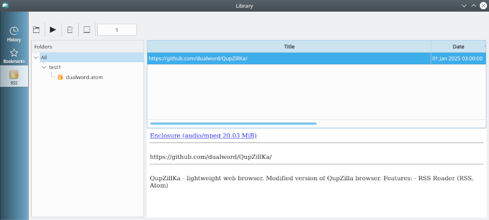
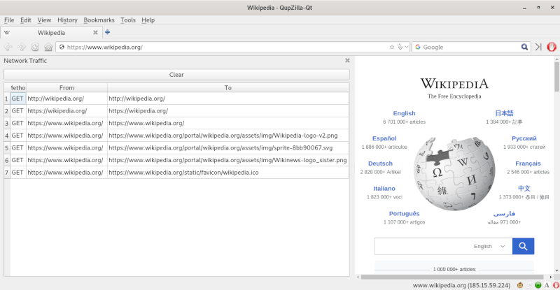
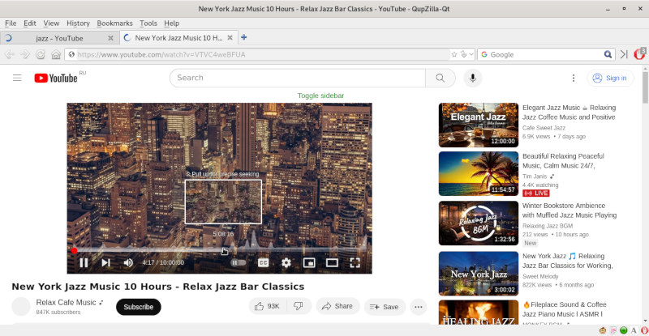
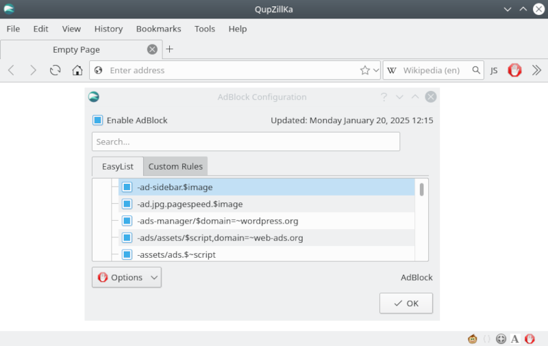

QupZillKa - lightweight web browser. Modified version of QupZilla browser.  

Features:
 - RSS Reader (RSS, Atom)
 
Plugins:
 - AdBlock
 - GreaseMonkey / Userscripts ([UserScripts.md](userscripts/))
 - StatusBar Icons (JavaScript on/off, network status, current user agent)
 - User Agent Manager (random user agent from a file)
 - Network Traffic Monitor
 - Screenshot

License: GNU General Public License (Version 3)  
Source code: https://github.com/dualword/QupZillKa/  

<table width="100%" border="1" cellpadding="1" cellspacing="1">
<tr>
    <td align='center'></td>
</tr>
<tr>
    <td align='center'>
    &nbsp;</td>
</tr>
<tr>
    <td align='center'></td>
</tr>
</table>
